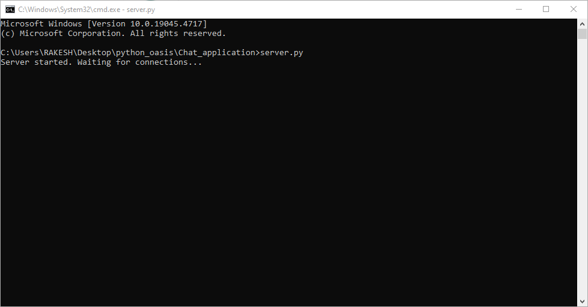
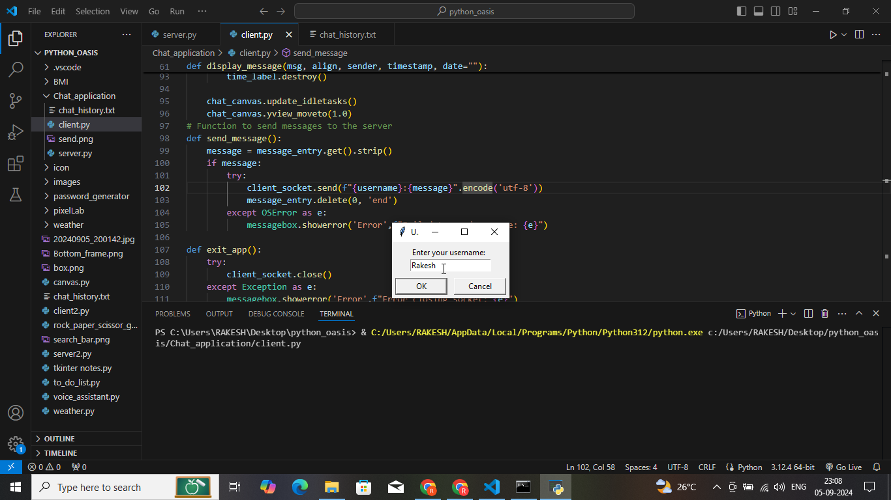
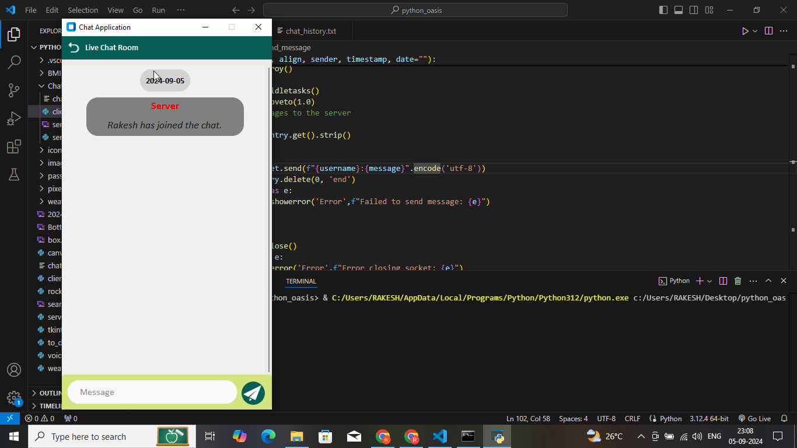
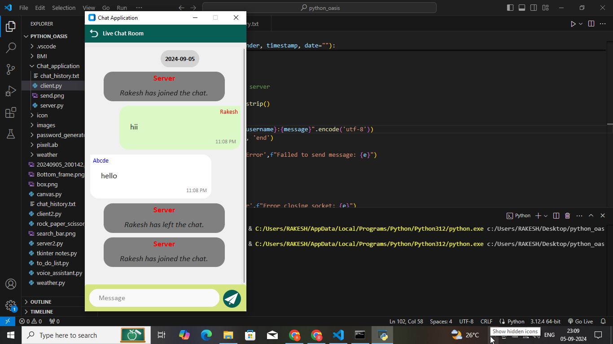
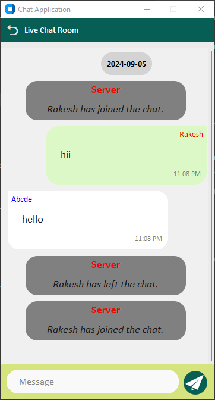

# Python Chat Application

This is a Python-based real-time chat application that allows multiple users to communicate over a network. The application consists of a server and client interface, where the server manages user connections, message broadcasting, and chat history. The client provides a graphical user interface (GUI) using **CustomTkinter** to facilitate smooth interactions between users.

## Features

- **User Authentication:** Users are required to enter a username before connecting to the chat server. 
- **Message Broadcasting:** Messages sent by users are broadcasted to all connected clients.
- **Message History:** The server maintains a history of chat messages, which is loaded by new clients when they join the server.
- **Custom GUI:** A sleek and responsive GUI built using CustomTkinter with message bubbles, date labels, and a scrollbar for easy navigation.
- **Persistent Chat History:** All messages are logged with timestamps and stored in a `chat_history.txt` file.
- **Real-time Updates:** Messages are displayed in real time, and each message is tagged with the sender's name and timestamp.
- **Message Alignment:** The sender’s messages are aligned to the right, while other users' messages are aligned to the left.
- **Date-wise Message Segregation:** Messages are grouped and displayed under their respective dates.
- **Error Handling:** Graceful handling of socket errors and message formatting issues.

## Server Setup

### `server.py`

The server script handles client connections, broadcasts messages, and manages chat history. It keeps track of active users and sends chat history to new clients when they join.

### Features:
- Tracks connected users and handles multiple clients concurrently using threading.
- Logs all chat messages with timestamps in `chat_history.txt`.
- Sends chat history to newly connected clients upon request.

### How to Run the Server

1. Run the server on your machine:
   ```bash
   python server.py
   ```

2. The server will start listening for incoming client connections on `localhost` and port `12345` (or a custom IP/port).

## Client Setup

### `client.py`

The client script provides a graphical interface using **CustomTkinter**. It allows users to send and receive messages in real time. It also loads the chat history from the server when a user connects.

### Features:
- Prompts the user to enter a username.
- Displays chat messages with proper alignment based on the sender.
- Includes a send button with an icon to trigger message sending.
- Date labels appear whenever the date of the messages changes.
- A scrollable chat area to view the conversation history.

### How to Run the Client

1. Run the client on your machine:
   ```bash
   python client.py
   ```

2. The client will prompt you for a username. After entering a valid username, it will connect to the server.
3. Upon connection, the chat history will be loaded, and you can start chatting with other users.

### GUI Design

- The GUI has a top header with a title and an exit button.
- The main chat window shows messages with time stamps and dates.
- A typing area is provided at the bottom, with a text entry box and a send button.

## Requirements

- **Python 3.8+**
- **CustomTkinter**
- **Pillow** (for the image used in the send button)

To install the dependencies, run:
```bash
pip install customtkinter Pillow
```

## Screenshots








## Future Enhancements

- **Emoji Support:** Add a button to insert emojis into messages.
- **Private Messaging:** Implement direct messaging between users.
- **File Sharing:** Add functionality to share files between users.

## Contributing

Feel free to open an issue or submit a pull request if you'd like to contribute to the project.

---

This chat application was developed as part of an internship project at oasis infobyte to demonstrate Python's capabilities in building real-time network applications using **sockets**, **CustomTkinter**, and **multithreading**.

